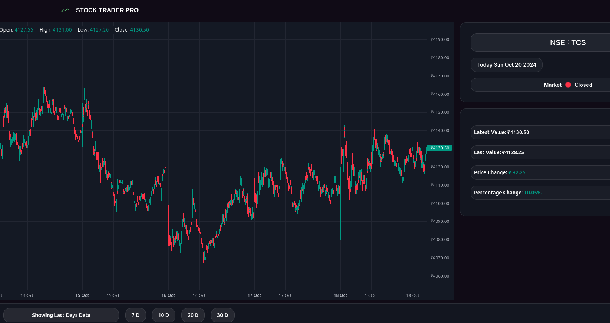

# StockTraderPro

Welcome to **StockTraderPro**, your ultimate solution for managing and analyzing stock trades efficiently.


## Features

- **Real-time Data**: Get the latest stock prices and market trends.
- **Portfolio Management**: Track your investments and performance.
- **Advanced Analytics**: Utilize charts and graphs to make informed decisions.
- **Alerts & Notifications**: Stay updated with custom alerts.



## Installation

1. Clone the repository:
   ```bash
   git clone https://github.com/yourusername/StockTraderPro.git
   ```
2. Navigate to the project directory:
   ```bash
   cd StockTraderPro
   ```
3. Install dependencies:
   ```bash
   npm install
   ```

## Usage

1. Start the application:
   ```bash
   npm start
   ```
2. Open your browser and go to `http://localhost:3000`.

## Contributing

We welcome contributions! Please read our [Contributing Guidelines](CONTRIBUTING.md) for more details.

## License

This project is licensed under the MIT License. See the [LICENSE](LICENSE) file for details.

## Contact

For any inquiries or feedback, please contact us at [support@stocktraderpro.com](mailto:support@stocktraderpro.com).


Thank you for using StockTraderPro!
